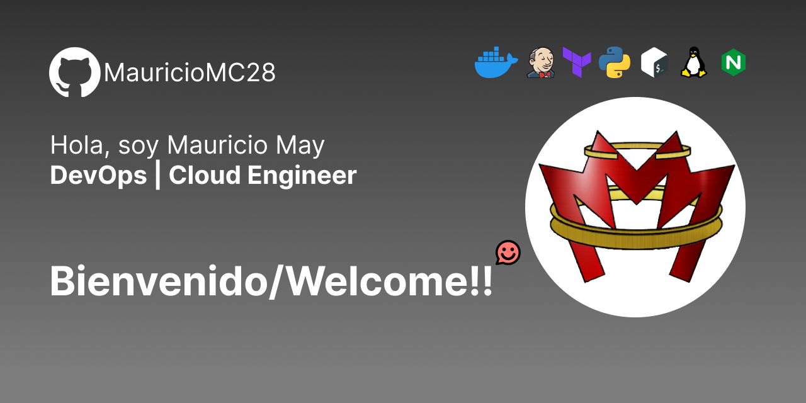

<div align="center">
  </img>
  <h1>Prepara tu propio ambiente de DevOps en diferentes entornos</h1>
  <p>Este repositorio encontrarás scripts de instalación de tecnologías y herramientas de un DevOps, asi como archivos de configuracion para facilitar el despliegue, así como recursos relacionados.
Actualizado para 2024-2025</p>
</div>

### Tabla de Contenido:

1. [Entorno Local](##entorno-local)
   1. [Debian 12](###debian-12)
      1. [Tecnologías y Herramientas](####tecnologias-y-herramientas)
   2. [Windows](###windows)
2. [Entorno en la nube](##entorno-en-la-nube)

---

<div>
  <h2 align="center">Entorno Local</h2>
  <h3>Debian 12</h3>
  <p>Despliega rapidamente las tecnologías más populares de DevOps utilizando el sistema WSL version 2</p>
  <h4>Tecnologías y Herramientas</h4>
  <table>
    <tr>
      <th>1</th>
      <td>2</td>
    </tr>
    <tr>
      <th>3</th>
      <td>4</td>
    </tr>
  </table>
  Automatización
    Ansible `2.16.11`
    Infraestructura como Código Terraform `1.9.7`
  Contenedores
    Docker `27.3.1`
    Minikube `1.33.1`
  Control de Versiones
    Git `2.39.2`
  Gateway
    Kong `Actualizar`
  Lenguajes de Programación
    Python `3.11.2`
    Node `3.2.0`
  Monitoreo
    Prometheus `2.55.0`
    Grafana `11.22.0`
  Pipelines CI/CD
    Jenkins `2.462.3`

  <h4>Procedimiento</h4>

  1. Ejecuta el script Esenciales
  2. El script de esenciales se encarga de actualizar el Sistema Operativo y las librerias, también se encarga de instalar herramientas importantes como, curl, Python, gpg (GnuPG), GNU Wget y git.
  3. Crea un archivo llamado `esenciales.sh`
  4. Pega el contenido de <a href="https://github.com/MauricioMC28/DevOps-Environment/blob/main/local-linux/esenciales.sh">esenciales</a> al archivo
  5. Hazlo ejecutable con el siguiente comando `chmod +x esenciales.sh`
  6. Ejecutalo como root `sudo ./esenciales.sh`

</div>

## Herramientas Locales recomendadas 
- `WSL2`: Herramienta que permite trabajar con Linux dentro de Windows.
- `Git`: Herramienta que permite gestionar versiones
- `Terraform`: Herramienta que permite automatizar infraestructura
- `Ansible`: Herramienta que permite automatizar la configuración de servidores
- `Docker`: Herramienta que permite gestionar contenedores
- `Minikube o Kind`: Herramienta que permite ejecutar clúster de Kubernetes

### Descarga WSL2 e instala Debian
<a href="https://gist.github.com/MauricioMC28/90fee9f004f46a7b392e534298abf892"> Instalación de WSL </a>

### Descarga Visual Studio Code e instala la extensión de Remote Explorer.

<a href="https://code.visualstudio.com/sha/download?build=stable&os=win32-x64-user"> Descargar visual Studio Code para Windows 11 </a>

### Esenciales

- Ejecuta Debian
- Crea un script en Bash para instalar los esenciales

```
touch esenciales.sh
```

Copia el contenido de <a href="https://github.com/MauricioMC28/devops/blob/main/esenciales.sh"> devops_tools.sh </a> dentro del archivo esenciales.sh utilizando el editor nano

```
nano esenciales.sh
```
#### Utiliza click Derecho para pegar el contenido
Utiliza las teclas `CTRL` + `O` Para guardar y `CTRL` + `X` para salir.

Utiliza el siguiente comando para hacer ejecutable el script
```
chmod +x esenciales.sh
```

#### Ejecuta el script
```
sudo ./esenciales.sh
```

### El script de esenciales actualiza el sistema e instala las siguientes herramientas:
- curl 7.88.1
- Python 3.11.2
- gpg (GnuPG) 2.2.40
- GNU Wget 1.21.3 built on linux-gnu.
- git version 2.39.2

### El script de Docker
- Cliente Docker Engine: 27.3.1
- Servidor Docker Engine: 27.3.1
- Containerd: 1.7.22 

### El script de Ansible
- ansible [core 2.16.11]

### El script de minikube descarga e instala Kubectl y minikube
- Kubectl Client Version: v1.31.0
- Kustomize Version: v5.4.2
- minikube version: v1.33.1

### El script de Terraform
- Terraform v1.9.7

---

## Herramientas recomendadas en contenedores o en la nube:
- `Prometheus + Grafana`: Herramientas de monitoreo
- `Jenkins`: Herramienta para montar pipelines de CI/CD

> [!IMPORTANT]
> Para la instalación de las herramientas de monitoreo y Jenkins, es necesario contar con esenciales y Docker instalados en el sistema.

### Script de Jenkins
- Version 2.462.3

### Script de Grafana
- Latest version: 11.22.0

### Script de Prometheus
- Latest version: 2.55.0
